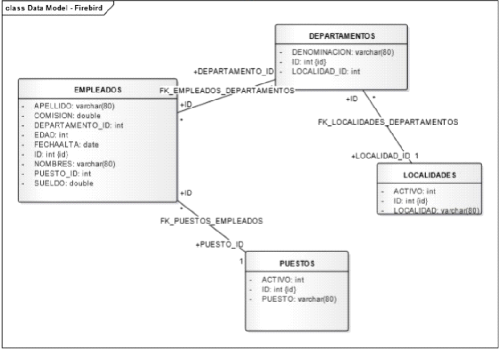

# Prueba Técnica - Flexxus

## DataBase SQL Queries

Dada la siguiente base de datos relacional: 

**RESUELVA LAS SIGUIENTES CONSULTAS EN SQL:**

1. **Mostrar los nombres de los empleados ordenados alfabéticamente (Z...A).**

2. **Seleccionar el nombre, el puesto y la localidad donde trabajan los empleados con puesto de ‘Soporte’.**

3. **Listar los nombres de los empleados cuyo nombre termine con la letra ‘o’.**

4. **Seleccionar el nombre, el puesto y sueldo de los empleados que trabajan en la localidad Carlos Paz.**

5. **Seleccionar el nombre, sueldo y localidad donde trabajan de los empleados que tengan un sueldo entre 10000 y 13000.**

6. **Visualizar los departamentos con más de 5 empleados.**

7. **Nombre de los empleados que trabajan en Córdoba y cuyo puesto sea ‘Analista’ o ‘Programador’.**

8. **Calcula el sueldo medio de todos los empleados.**

9. **¿Cuál es el máximo sueldo de los empleados del departamento 10?**

10. **Calcula el sueldo mínimo de los empleados del departamento ‘Soporte’.**

11. **Para cada puesto, obtener la suma de sueldos.**
