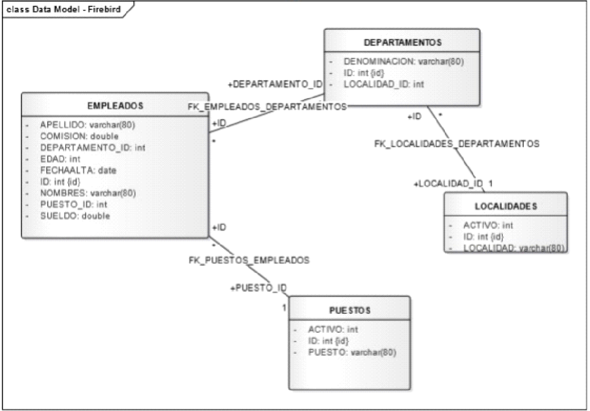

# Inicialización de Base de Datos SQL y Ejecución de Consultas

Este proyecto permite configurar y ejecutar consultas SQL, generando un archivo Markdown (`RESULTS.md`) que contiene tanto las consultas realizadas como los resultados obtenidos. Puedes optar por utilizar una base de datos MySQL generada mediante Docker o conectarte a una base de datos externa.

## Opciones de Configuración

#### **Asegurarse siempre de estar dentro de la carpeta `Sql-Queries` en la terminal**

### Opción 1: Usar Base de Datos Generada con Docker Compose (Datos Ficticios)

1. **Inicia el contenedor de Docker**:

   ```bash
   docker-compose up
   ```

2. **Ejecuta las consultas**:

    Una vez que el contenedor esté funcionando correctamente, ejecuta:

   ```bash
   npm run execute
   ```

3. **Verifica los resultados**:

    Finalizado el proceso, se creará un archivo `RESULTS.md` en la carpeta `Sql-Queries`, que contendrá las consultas realizadas junto con los resultados obtenidos.


### Opción 2: Conectar a una Base de Datos Externa

Si deseas utilizar una base de datos externa asegurate de leer [Estructura de Base de Datos](#diagrama-entidad-relacion-er-de-la-base-de-datos) y posteriormente seguir los siguientes pasos:

1. **Configura las variables de entorno**:

    Crea un archivo `.env` en la carpeta raíz (`Sql-Queries`) e incluye las siguientes variables, completando con los datos de tu base de datos externa:

   ```bash
    EXTERNAL_DATABASE=<nombre_base_datos>
    EXTERNAL_DB_ROOT_USER=<usuario>
    EXTERNAL_DB_ROOT_PASSWORD=<contraseña>
    EXTERNAL_DB_HOST=<host>
    EXTERNAL_DB_PORT=<puerto>
    EXTERNAL_DB_DIALECT=<mysql | postgres | etc>
   ```
    **Nota:** Asegúrate de que el gestor de base de datos sea compatible con Sequelize.

2. **Ejecuta las consultas**:

    Ejecuta el siguiente comando para conectar a la base de datos externa y obtener los resultados:

   ```bash
   npm run execute
   ```

3. **Verifica los resultados**:
   
    Se generará el archivo `RESULTS.md` en la carpeta `Sql-Queries` con las consultas y los resultados obtenidos.

## Configuración Opcional: Personalizar Base de Datos en Docker

Si deseas modificar la configuración de la base de datos generada en Docker, puedes crear un archivo `.env` en la carpeta raíz (`Sql-Queries`) y definir las siguientes variables:

```bash
MYSQL_ROOT_PASSWORD=<contraseña>
MYSQL_DATABASE=<nombre_base_datos>
MYSQL_HOST_PORT=<puerto_host>
MYSQL_CONTAINER_PORT=<puerto_contenedor>
```
## Actualización del Archivo `RESULTS.md`

Si ya has ejecutado consultas anteriormente y deseas actualizar los resultados en `RESULTS.md`, puedes ejecutar directamente:

```bash
npm start
```
## Diagrama Entidad-Relación (ER) de la Base de Datos

Para configuraciones externas, asegúrate de que tu base de datos respete la siguiente estructura:



## Notas Adicionales
 * Si se usa una Base de Datos Externa asegúrate de completar todos los valores en el archivo `.env` correspondiente antes de ejecutar el comando npm run execute.
 * Este proyecto está configurado para entornos compatibles con Sequelize.

